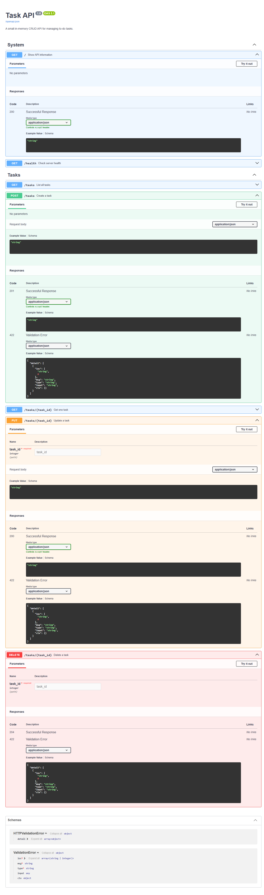
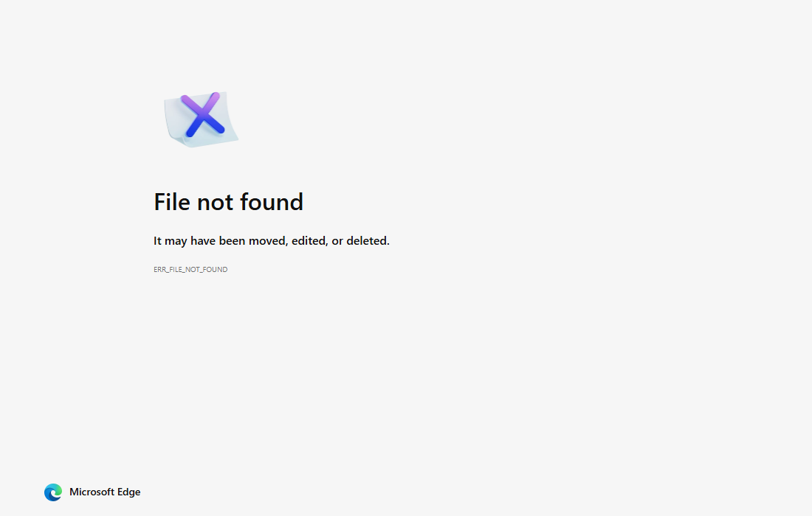

# Task API

A small FastAPI CRUD API for managing a to-do list. The API now stores tasks in SQLite, so data survives server restarts.

## Why SQLite

SQLite was chosen because it is lightweight, free, and stores the whole database in a single local file. It does not need a separate database server, which makes it a good fit for this first database assignment.

The database file is created automatically at the project root:

```text
tasks.db
```

`tasks.db` is not committed to GitHub. When someone runs the project, the app creates the database and the `tasks` table if they do not already exist. The three example tasks are inserted only when the table is empty.

## Install

```bash
python -m pip install -r requirements.txt
```

## Run

```bash
python -m uvicorn main:app --reload --port 8000
```

Open the API at:

```text
http://localhost:8000
```

Open Swagger UI at:

```text
http://localhost:8000/docs
```

## Endpoints

| Method | Path | Description | Success |
|---|---|---|---|
| `GET` | `/` | API information | `200` |
| `GET` | `/health` | Health check | `200` |
| `GET` | `/tasks` | List all tasks | `200` |
| `GET` | `/tasks/{id}` | Get one task | `200` |
| `POST` | `/tasks` | Create a task | `201` |
| `PUT` | `/tasks/{id}` | Update a task title and/or done status | `200` |
| `DELETE` | `/tasks/{id}` | Delete a task | `204` |

Error behavior:

| Case | Status |
|---|---:|
| Missing or empty `title` on create | `400` |
| Empty or invalid update body | `400` |
| Unknown task id | `404` |

## Example Curl Output

Command:

```bash
curl -i http://localhost:8000/tasks/1
```

Output:

```text
HTTP/1.1 200 OK
server: uvicorn
content-type: application/json

{"id":1,"title":"Learn HTTP basics","done":false}
```

## Example Requests

Create a task:

```bash
curl -i -X POST http://localhost:8000/tasks -H "Content-Type: application/json" -d "{\"title\":\"Buy milk\"}"
```

Update a task:

```bash
curl -i -X PUT http://localhost:8000/tasks/4 -H "Content-Type: application/json" -d "{\"title\":\"Updated task\",\"done\":true}"
```

Delete a task:

```bash
curl -i -X DELETE http://localhost:8000/tasks/4
```

## SQL Query Example

One query executed manually against `tasks.db`:

```sql
SELECT * FROM tasks;
```

Other required SQL exploration notes are in [`docs/assignment-2/sql-queries.md`](docs/assignment-2/sql-queries.md).

## Screenshots

Swagger UI:



SQLite database view:


